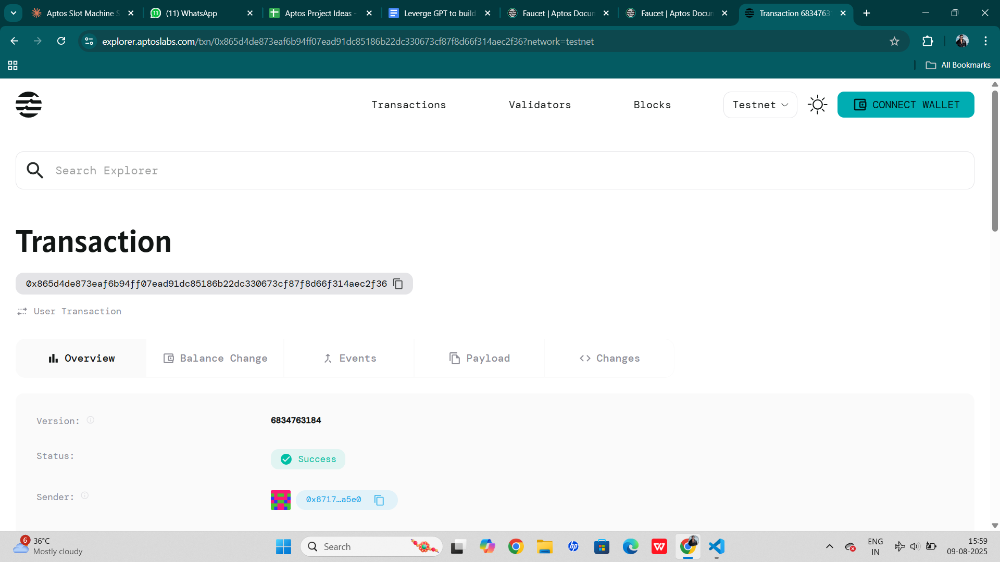

# Slot Machine

## Project Description

The Slot Machine smart contract is a decentralized gambling application built on the Aptos blockchain that implements classic slot machine mechanics with progressive jackpots. Players can spin the slot machine by placing bets in AptosCoin, with the chance to win various prizes based on the combination of three randomly generated numbers (0-9). The contract features a progressive jackpot system where a portion of each bet contributes to a growing jackpot pool, creating excitement and increasing potential rewards over time.

## Project Vision

Our vision is to create a transparent, fair, and entertaining blockchain-based gaming experience that combines the thrill of traditional slot machines with the security and transparency of smart contracts. By leveraging blockchain technology, we ensure that all game outcomes are provably random and that the progressive jackpot system operates with complete transparency, building trust between players and the platform.

## Key Features

- **Progressive Jackpot System**: A percentage of each bet contributes to a growing jackpot pool that can be won with a triple-seven combination
- **Multiple Win Conditions**: 
  - Jackpot (777): Win the entire progressive jackpot pool
  - Three of a Kind (except 777): Win 10x the bet amount
  - Two of a Kind: Win 2x the bet amount
- **Provably Fair Gaming**: Uses Aptos blockchain's randomness module to ensure fair and unpredictable outcomes
- **Transparent Economics**: 
  - 10% of each bet goes to the progressive jackpot
  - 40% goes to house earnings
  - 50% available for player payouts
- **Fixed Bet System**: Consistent betting amounts ensure fair play for all participants
- **Comprehensive Tracking**: Monitors total spins and maintains detailed game statistics

## Future Scope

- **Multi-Denomination Slots**: Support for different bet amounts and corresponding jackpot tiers
- **Enhanced Game Variants**: Introduction of different slot themes with varying payout structures
- **Player Rewards Program**: Loyalty system rewarding frequent players with bonus spins or reduced house edges
- **Tournament Mode**: Competitive slot tournaments with leaderboards and special prizes
- **Social Features**: Player profiles, achievement systems, and social sharing of big wins
- **Mobile Integration**: Native mobile app with seamless wallet integration
- **Cross-Chain Compatibility**: Expansion to other blockchain networks for broader accessibility
- **Advanced Analytics**: Detailed player statistics and game history tracking
- **Customizable Slot Machines**: Allow machine owners to set different parameters and themes
- **NFT Integration**: Collectible slot machine themes and special bonus features through NFTs

## Contract Details

*[Content to be added by the developer]*

0x865d4de873eaf6b94ff07ead91dc85186b22dc330673cf87f8d66f314aec2f36
